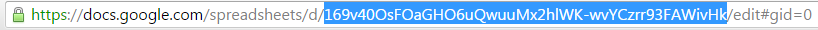
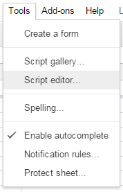
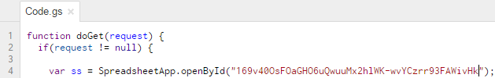
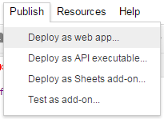
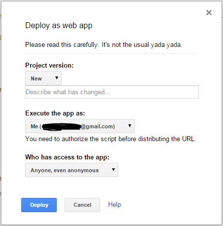
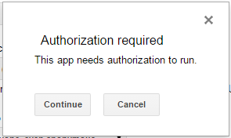
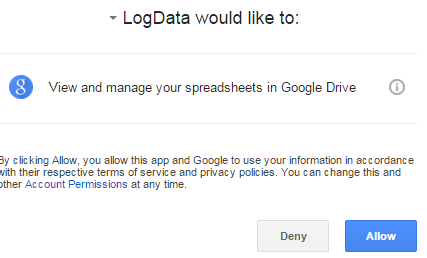
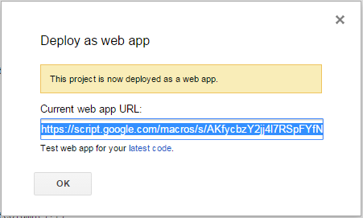

# SmartThings Google Sheets Logging

## Create the Spreadsheet

1. Create a new spreadsheet: http://docs.google.com/spreadsheets/create

2. Name the spreadsheet file whatever you want

3. Get your new spreadsheet ID from the URL. Example:
 https://docs.google.com/spreadsheets/d/169v40OsFOaGHO6uQwuuMx2hlWK-wvYCzrr93FAWivHk/edit#gid=0  
	example id is "169v40OsFOaGHO6uQwuuMx2hlWK-wvYCzrr93FAWivHk"
	
 

4. Add the single value "Time" in cell A1.  You might consider selecting View -> Freeze -> 1 Row 

5. Create the helper script
 1.  Open script: Click Tools -> Script Editor.  Optionally change the name of the project (default "Untitiled project")  
    

 2. Copy the contents of Code.gs to replace the stub "function myFunction"
 3. On line 4, Replace "REPLACE ME WITH SPREADSHEET ID" with sheet id from step 3  
   

 4. If you changed the name of the sheet (the name in the tab at the bottom of the spreadsheet, not the name of the file), update it on line 5. (defaults to "Sheet1").

6. Deploy helper script as webapp
 1. Deploy webapp: Click Publish -> Deploy as web app  
   

 2. Change Who has access to the webapp to "Anyone, even anonymous".  Please note, if any one gets a hold of your published endpoint, they will be able to send data to your spreadsheet, but they will not be able to view any of it.  
     
   Also: If you revise or fix your webapp code, **be sure to select `New` as the version** on the webapp publishing popup's Version drop-down. Otherwise you may continue to run the older version. Version management must be explicitly performed sometimes.

 3. Approve the access to the app  
   
   

 4. Copy the URL on the confirmation page.  
   E.g.: https://script.google.com/macros/s/AKfycbzY2jj4l7RSpFYfN62xra0HmcXPQXAUI17z6KKHWiT3OYyhUC4/exec  
   

 5. Extract URL key for your new webapp, it is between /s/ and /exec.
   `AKfycbzY2jj4l7RSpFYfN62xra0HmcXPQXAUI17z6KKHWiT3OYyhUC4`  
   You will need to enter this into the SmartApp below.

7. (Optional): Test out your new webapp, add this to the end of the URL from step 6: `?Temp1=15&Temp2=30`  
   E.g., https://script.google.com/macros/s/AKfycbzY2jj4l7RSpFYfN62xra0HmcXPQXAUI17z6KKHWiT3OYyhUC4/exec?Temp1=15&Temp2=30  
   A successful test will return the message `The script completed but did not return anything.`

   **If you do test it, make sure you delete the test data from the spreadsheet.  Just delete any rows added after row 1 and any test columns**

## Create the SmartApp

1. Login to the the SmartThings IDE at https://graph.api.smartthings.com/  
   (Make an account if you haven't already)

2. Go to "My SmartApps"

3. Use **either** Github Integration (step 4) or Manual (step 5)

4. Github Integration  
   (See this link if this is your first time using GitHub Integration: http://docs.smartthings.com/en/latest/tools-and-ide/github-integration.html)
   1. Click Settings
   2. Add this repo:  
      Owner: `loverso-smartthings`  
      Name: `googleDocsLogging`  
      Branch: `master`
   3. Click Save
   4. hit "Update from Repo" and select `googleDocsLogging (master)`
   5. Under "New (Only in GitHub)" select "google-sheets-logging"
   6. Select the checkbox next to "Publish"
   7. Click "Execute Update"

5. Manual creation **(If you didn't follow step 4)**
   1. hit "+ New SmartApp" on the right, then select the "From Code" tab.
   2, In another window, open the source code located in this repo at smartapps/cschwer/google-sheets-logging.src/google-sheets-logging.groovy
      https://github.com/loverso-smartthings/googleDocsLogging/blob/master/smartapps/cschwer/google-sheets-logging.src/google-sheets-logging.groovy
   3. Click "Raw" and copy all the code
   4. Paste the code into the New SmartApp "From Code" box and click Create

## Install the SmartApp

1. In Smartthings App go to marketplace -> Smartapps -> My Apps -> Google Sheets Logging

2. Select events you want to log under "Log devices..."

3. Enter URL key from step 6(v) under "URL key"

4. Click Done!
